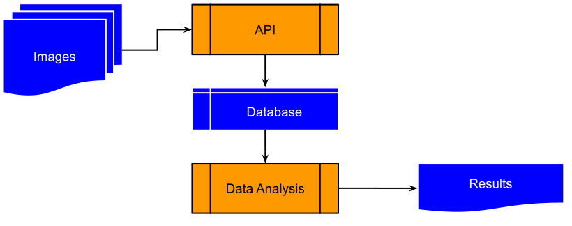

# Astronomical Bycatch
Astronomical Bycatch is a project to extract exoplanet transit detections from stars "in the background" of archival images. 

## Premise
Around the world, hundreds of professional observatories and thousands of amateur astronomers make observations every single night. Whatever the intended target of these observations, the images produced always include some stars from the solar neighbourhood. The sheer number of observations guarantees that exoplanet transit events are serendipitously observed. 

## High-Level Design
The overall structure of the project is laid out in Figure 1. Astronomical archives contain sequences of images taken at the sensitivity limits of the instruments used. These images have variation in signal and noise characteristics both within and between images. The API corrects for these variations and extracts flux parameters for each of the sources in the image. These parameters, together with source and observation information is recorded in the database. By linking multiple observations of the same source, both short- and long-term analysis can be performed. The short-term analysis focuses on identifying and fitting light-curves to transit events. Longer-term analysis includes identifying recurring transits, and fitting the recurrence time to identify the period of the exoplanet.

## Funding
Astronomical Bycatch has received funding from Enterprise Ireland through a Feasibility Study under the Innovation Partnership Program grant number IP20252215Y.
